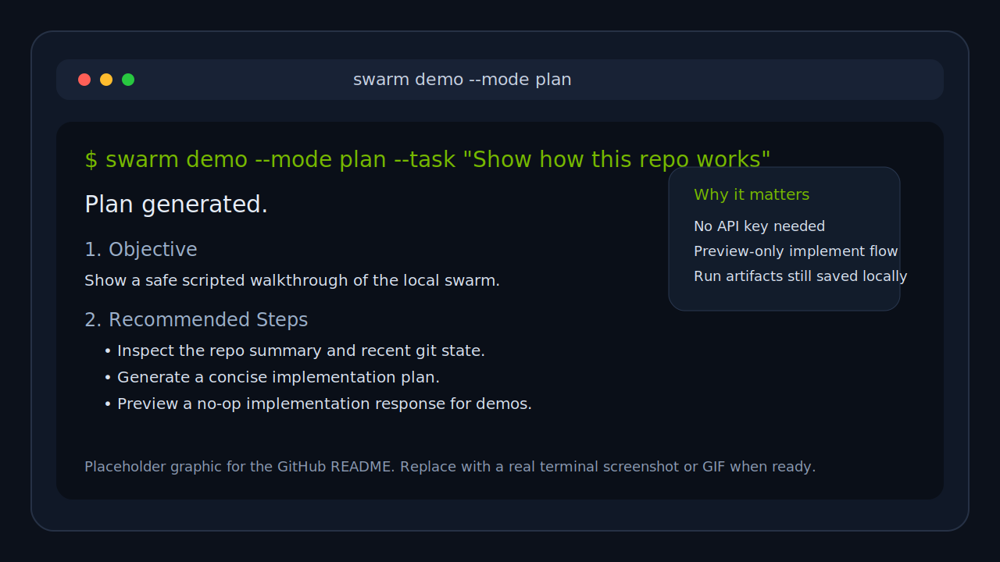
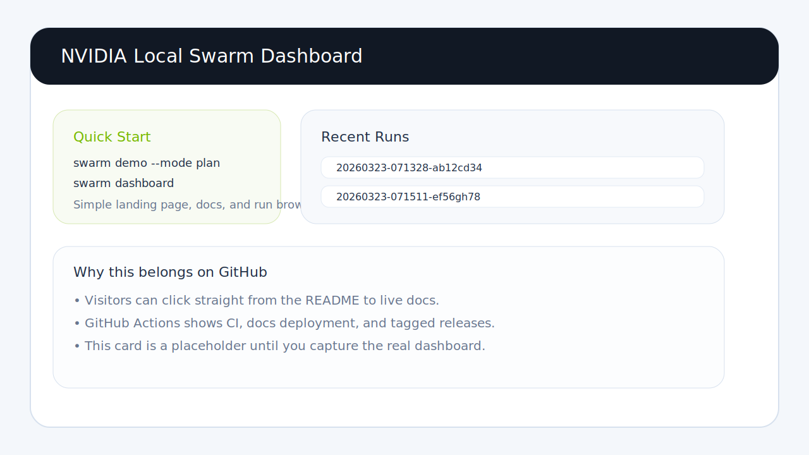

# NVIDIA Local Dev Swarm

[](https://github.com/akshitnanda/Nvidia-ai/actions/workflows/ci.yml)
[](https://akshitnanda.github.io/Nvidia-ai/)
[](https://github.com/akshitnanda/Nvidia-ai/releases)

Local-first multi-agent developer workflow for Python repos, with NVIDIA-hosted inference for real runs and a scripted `demo` mode for GitHub walkthroughs.

GitHub:

- Repo: https://github.com/akshitnanda/Nvidia-ai
- Docs: https://akshitnanda.github.io/Nvidia-ai/
- Actions: https://github.com/akshitnanda/Nvidia-ai/actions
- Releases: https://github.com/akshitnanda/Nvidia-ai/releases

## Demo Preview

Replace these with real screenshots or a short GIF later; for now they give the GitHub landing page a visual “what this is” section.

### CLI Demo Slot



### Dashboard Slot



## Why This Repo Is Easier To Demo Now

- `swarm demo` runs without an API key and keeps the repo clean.
- `scripts/demo.ps1` gives Windows users a one-command walkthrough.
- The FastAPI dashboard now has a simple landing page at `/` instead of only raw JSON endpoints.
- GitHub Actions runs CI, deploys a Pages docs site, and publishes release artifacts from version tags.

## Fastest First Run

### Windows PowerShell

```powershell
powershell -ExecutionPolicy Bypass -File scripts/bootstrap.ps1
swarm demo
swarm dashboard
```

Then open `http://127.0.0.1:8787/`.

If you want the docs site locally:

```powershell
powershell -ExecutionPolicy Bypass -File scripts/docs.ps1
```

### Cross-platform Python

```bash
python -m venv .venv
. .venv/bin/activate  # Windows: .venv\Scripts\Activate.ps1
python -m pip install --upgrade pip
python -m pip install -e ".[dev]"
python -m app.cli.app demo
python -m app.cli.app dashboard
```

## Demo Modes

Use demo mode when you want a safe GitHub or screen-share walkthrough:

```powershell
swarm demo --mode analyze
swarm demo --mode plan --task "Add a FastAPI health endpoint"
swarm demo --mode implement --task "Add a FastAPI health endpoint"
```

What demo mode does:

- returns deterministic local responses
- writes run artifacts to `data/runs/`
- avoids real NVIDIA API calls
- keeps `implement` preview-only by default

## Live NVIDIA Mode

When you want real model output instead of the scripted demo path:

1. Copy `.env.example` to `.env` if you have not already.
2. Set `NVIDIA_API_KEY`.
3. Keep `NVIDIA_PROVIDER_MODE=serverless` for NVIDIA-hosted inference, or switch to `local_nim` for a self-hosted compatible endpoint.

Example:

```powershell
swarm plan "Add a FastAPI health endpoint and tests"
swarm implement "Add a FastAPI health endpoint and tests" --apply
swarm review
swarm release --since HEAD~5
```

## Dashboard

The optional FastAPI dashboard exposes:

- `/` for a lightweight browser-friendly landing page
- `/docs` for the Swagger UI
- `/health` for a simple health check
- `/runs` and `/runs/{run_id}` for local run artifacts

Start it with:

```powershell
swarm dashboard
```

## GitHub Pages Docs

The repo now includes an Actions-based docs site powered by MkDocs.

- source lives under `docs/`
- config lives in `mkdocs.yml`
- `.github/workflows/pages.yml` builds docs on pull requests
- pushes to `main` deploy to GitHub Pages

To preview locally:

```powershell
powershell -ExecutionPolicy Bypass -File scripts/docs.ps1
```

In GitHub, set `Settings` -> `Pages` -> `Source` to `GitHub Actions`.

## Releases

Version tags now publish release assets automatically through `.github/workflows/release.yml`.

Published artifacts include:

- wheel
- source distribution
- zipped docs site
- `SHA256SUMS.txt`
- packaged default config and prompts inside the wheel so the CLI still has a baseline config when installed outside this repo

Automatic path:

```bash
git tag v0.1.0
git push origin v0.1.0
```

Manual path:

- open the `Release` workflow in GitHub Actions
- run `workflow_dispatch`
- provide a tag such as `v0.1.0`

## CLI Commands

```text
swarm analyze-repo
swarm plan "<task>"
swarm implement "<task>" --apply
swarm review
swarm release --since HEAD~5
swarm watch-repo --mode review
swarm dashboard
swarm demo --mode plan
```

## Architecture At A Glance

```text
CLI / Dashboard
      |
      v
Local Orchestrator
      |
      +-- Agent Registry + Prompt Loader
      +-- Local Tools (repo, git, shell, filesystem)
      +-- Memory Store + Run Logger
      +-- Provider Registry
              |
              +-- NVIDIA serverless / local NIM
              +-- scripted demo provider
```

Key folders:

```text
app/
  agents/
  api/
  cli/
  memory/
  models/
  orchestrator/
  providers/
  tools/
  workflows/
config/
  prompts/
scripts/
tests/
```

## Validation

Run the local checks with:

```powershell
python -m pytest -q
python -m compileall app tests
```

GitHub Actions mirrors the test run on:

- Windows + Python 3.11 / 3.12
- Ubuntu + Python 3.11 / 3.12
- docs build + Pages deploy on `main`
- release packaging on tags matching `v*`

## Notes

- This repo is Windows-friendly first, but the core CLI also works cross-platform.
- Demo mode is intentionally scripted, so it is useful for onboarding and repo previews, not for judging model quality.
- Live runs store artifacts and usage logs under `data/`.
- The placeholder visuals in `docs/assets/` are meant to be replaced with a real CLI screenshot and dashboard capture when you are ready.
- Workspace-local `config/` still wins, but release artifacts now carry packaged fallback defaults for cleaner installs and demos.
